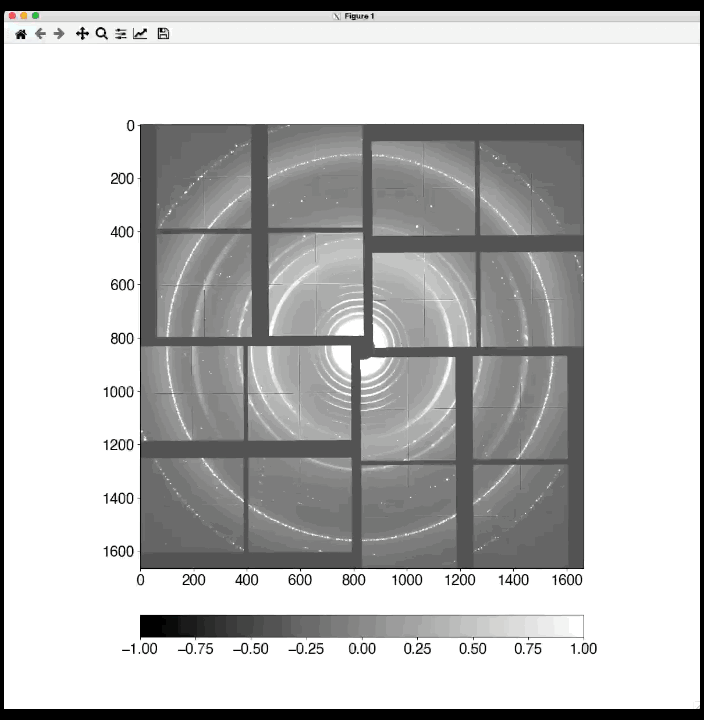

# spatial-calib-xray


Spatial calibration of small and wide angle X-ray scattering/diffraction data by
fitting circles.  


## Installation

- Directly from github with `pip`

  ```bash
  pip install git+https://github.com/carbonscott/spatial-calib-xray --upgrade --user
  ```


## Dependencies

```bash
scipy
numpy
lmfit
matplotlib
```


## Fit a circle by three clicks

Three clicks will provide a initial circle, whose radius and center position is
then refined through optimization.  


