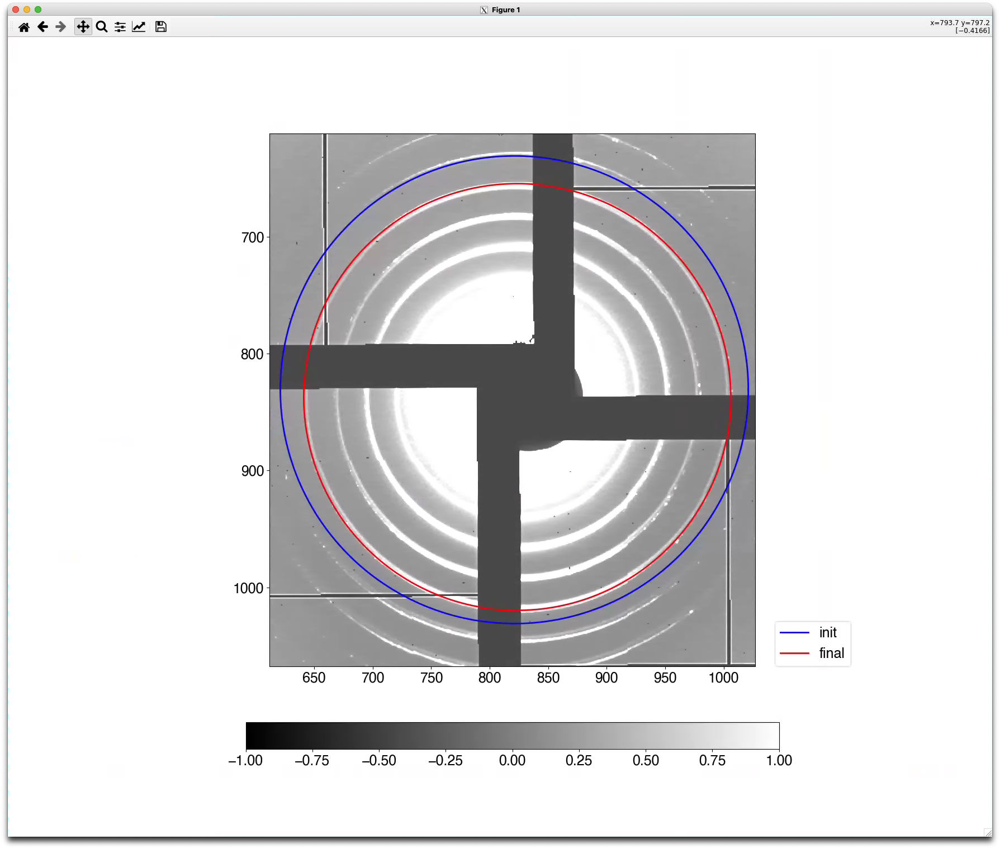

# spatial-calib-xray



Spatial calibration of small and wide angle X-ray scattering/diffraction data by
fitting circles.  


## Installation

- Directly from github with `pip`

  ```bash
  pip install git+https://github.com/carbonscott/spatial-calib-xray --upgrade --user
  ```


## Dependencies

```bash
scipy
numpy
lmfit
matplotlib
```


## To do

- [ ] Make a GUI to fetch initial parameters by three-point clicking.  
